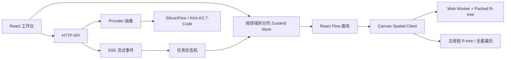

# Canvas Flow：面向 Updream 前端岗位的技术深度说明

## 1. 项目定位

Canvas Flow 是一个面向创作者的 AI 原生工作台：左侧管理素材，中间用节点画布组织创作关系，右侧通过流式 AI 对话理解意图、选择参考图、调用图片工具并把结果回写到画布。

当前范围暂不包含视频预览；本阶段优先补齐工作流执行、工程质量和可靠性证据。

这个项目的重点不是“做一个能生成图片的页面”，而是把创作者的一次创作请求拆成可观察、可取消、可恢复、可扩展的前端任务链路。

## 2. JD 能力映射

| JD 关注点 | Canvas Flow 的对应设计 |
| --- | --- |
| 节点画布、大数据量渲染 | React Flow + 视口裁剪 + Worker + Packed R-tree |
| AI 对话与流式任务 | SSE 事件流、任务状态机、AbortController、迟到事件保护 |
| 工作流编排 | 节点/边数据模型、DAG 校验、拓扑调度、节点级错误恢复 |
| 素材与视频预览 | 资产清单、视觉参考图、视频最小预览能力 |
| 复杂交互 | 框选、拖拽、缩放、撤销重做、侧栏调宽、上下文预览 |
| 工程质量 | 类型检查、纯函数测试、协议测试、构建门禁、benchmark |
| 线上稳定性 | Worker 三级降级、SSE 重连思路、错误分类、指标采样 |

## 3. 总体架构



### 状态边界

- `projectStore`：项目和画布切换。
- `canvasStore`：节点、边、视口、选中状态。
- `chatStore`：会话、消息和流式展示。
- `taskStore`：任务状态、进度、取消和错误。
- `assetStore`：资产列表、详情和引用关系。
- 组件本地状态：输入框、弹窗、拖拽宽度等瞬时交互。

React Flow 实例、Worker 实例和 AbortController 属于运行时资源，不进入 IndexedDB 快照。快照只保存可序列化的项目、节点、边、资产和任务数据。

## 4. 大画布性能方案

### 4.1 为什么同时使用 Worker 和 R-tree

两者解决的是不同问题：

- Worker 解决“计算占用哪个线程”，把空间查询从主线程移走；
- R-tree 解决“需要计算多少对象”，把范围查询从全量 `O(n)` 降为平均接近 `O(log n + k)`，其中 `k` 是命中的节点数量。

只使用 Worker，仍然可能在 Worker 中遍历 10,000 个节点；只使用 R-tree，索引查询结束后 React 仍可能因为大量节点更新阻塞主线程。

### 4.2 首期 Worker 边界

首期只迁移高收益、纯数据的工作：

1. 维护节点空间索引；
2. 查询当前视口节点；
3. 查询框选候选节点；
4. 记录查询耗时和版本。

布局计算保留在可扩展协议中，等 benchmark 证明布局是主要瓶颈后再迁移。React、Zustand、DOM 和 React Flow 实例始终留在主线程。

### 4.3 视口裁剪与背压

- 仅渲染视口节点以及一圈 overscan 节点，减少滚动边缘闪烁；
- 选中节点、运行中节点和连线相关节点即使离开视口也保留；
- 视口查询由 `requestAnimationFrame` 合并；
- Worker 同时只处理一个有效查询，后续请求采用 latest-wins；
- 增量 patch 按批次发送，避免每个鼠标事件都结构化克隆一份完整节点数组；
- 只有 profile 证明结构化克隆是瓶颈时，才升级到 `TypedArray + Transferable`。

### 4.4 数据一致性

初始化发送完整快照，后续 patch 带 `baseVersion` 和 `nextVersion`。Worker 只接受连续版本；发现版本缺口时请求重新初始化。查询带 `requestId` 和当前版本，主线程丢弃旧响应，避免缩放过程中旧结果覆盖新结果。

### 4.5 降级策略

```text
Worker + R-tree
       ↓ 初始化失败、Worker error、响应异常
主线程 + R-tree
       ↓ 索引不可用
主线程 + 全量遍历
```

三种实现共用 `queryVisible / boxSelect / updateNodes` 接口。降级不静默：开发环境输出诊断日志，线上采样记录 Worker 错误、降级次数、查询 P50/P95/Max、过期响应数和主线程长任务数。

### 4.6 Benchmark

运行：

```bash
npm run benchmark:canvas
```

数据固定为 10,000 个节点和 20,000 条边，使用固定随机种子生成三种分布：

- `uniform`：节点均匀分布；
- `clustered`：节点聚簇，模拟工作流模块；
- `overlap`：节点高重叠，模拟多轮生成结果堆叠。

每组执行小视口、大视口和框选查询，对比全量遍历与 R-tree，并验证两者返回的 ID 集合完全一致。记录 P50、P95 和 Max；平均值不作为唯一指标，因为平均值会掩盖长尾交互延迟。

目标不是在没有基线时宣称“快了多少”，而是让每次算法或渲染改动都能回答：

1. 结果是否一致？
2. P95 是否回退？
3. 主线程是否仍出现明显长任务？
4. 高重叠分布下是否发生退化？

最近一次本机 Node 微基准结果如下（绝对耗时会随机器和运行时变化，主要用于比较同一环境下的趋势）：

| 分布 | 全量遍历 P50 / P95 / Max | R-tree P50 / P95 / Max | 正确性 |
| --- | --- | --- | --- |
| uniform | 0.38 / 1.64 / 22.29 ms | 0.02 / 0.11 / 0.38 ms | PASS |
| clustered | 0.41 / 2.87 / 14.52 ms | 0.03 / 0.14 / 0.52 ms | PASS |
| overlap | 0.73 / 5.19 / 19.77 ms | 0.00 / 0.21 / 3.99 ms | PASS |

## 5. 流式 AI 任务

### 5.1 任务状态机

```text
created → queued → running → streaming → success
                           ↘ error
                           ↘ cancelled
```

每个事件携带 `taskId`、`runId`、递增 `sequence` 和 `requestId`。前端只接受当前任务、当前运行版本和未处理过的事件。重试创建新的 `runId`，保留原始 prompt、资产 ID 和模型参数作为输入快照。

### 5.2 取消语义

取消分两层：

1. 前端立即进入 `cancelling/cancelled`，调用 `AbortController` 停止消费流；
2. 通过 HTTP cancel 请求通知服务端停止 Provider 任务。

服务端取消是 best effort。取消后到达的 token、工具结果和 done 事件必须被前端忽略，不能把已经取消的消息重新改为成功。

### 5.3 SSE 与 WebSocket 的边界

当前 AI 生成主要是服务端到前端的单向事件流，因此使用 `SSE + HTTP cancel`：协议简单、浏览器调试方便、自动重连语义清晰。

WebSocket 适合：

- 多人协作画布中的节点、光标、选区和在线状态同步；
- 高频双向工作流控制，需要服务端 ACK；
- 多任务复用同一条双向长连接。

WebSocket 不用于图片文件上传下载，也不因为“更实时”就替代当前 SSE。若未来使用 WebSocket，仍需处理心跳、鉴权、重连、ACK、幂等、背压和 `lastSequence` 补偿。

## 6. 视觉上下文可靠传递

鼠标截图不是可靠的资产身份来源。前端显式发送资产清单：

```ts
type VisionAssetManifest = {
  assetId: string;
  imageUrl: string;
  mimeType: string;
  width: number;
  height: number;
  role: "reference" | "style" | "subject";
  prompt?: string;
};
```

服务端根据清单构造标准的文本块和 `image_url` 内容块，并在文本中标注“第几张图对应哪个资产 ID、用途和尺寸”。模型必须优先看图片本身，不能仅凭历史 prompt 猜测。

发送前的 UI 还需要展示当前将发送的图片，允许移除和排序。图片下载失败只跳过失效资产，并通过 `agent_warning` 告知用户；不能把整次对话静默降级成纯文本。

## 7. 工作流编排

当前已落地 `web/src/workflow/dagExecutor.ts`：执行前校验节点引用、自环、重复边和环路；运行时按拓扑依赖调度，限制最大并发数，支持节点重试、上游失败后的分支级跳过，以及 AbortSignal 取消。画布 Store 在创建连线时复用同一校验逻辑，避免把环路写入项目快照。

画布层与执行层分离：

- 画布层管理节点位置、边、选中和撤销重做；
- 执行层把节点和边解释为 DAG，执行前校验环路、输入和类型；
- 调度器按拓扑顺序运行节点，限制并发数；
- 单个节点失败时保留已完成结果，从失败节点重跑；
- 整条工作流取消时向下游传播取消。

推荐节点状态：

```text
idle → queued → running → success
                    ↘ error
                    ↘ cancelled
```

节点协议使用带 `type` 的联合类型和版本号。未知节点保留原始数据，避免升级后打开旧项目时丢失内容。

## 8. 视频预览边界

首期只增加最小可用能力：`<video>` 播放、暂停、进度拖动、封面、时长、加载中和错误状态；不直接实现完整非线性编辑时间轴。这样覆盖“素材 & 视频编辑预览”能力，同时把时间轴、音轨、切片和导出留作后续独立模块。

视频和图片资源都需要处理加载失败、取消加载、对象 URL 释放和跨项目切换时的订阅清理。

## 9. 工程化与安全

当前已落地：`npm run check` 会依次执行服务端/前端 TypeScript 检查、Vitest 单测、生产构建和画布 benchmark；GitHub Actions 对 push 和 pull request 执行相同门禁。开发环境的画布诊断面板显示查询 P50/P95/Max、Worker 降级次数和 Long Task 计数。

### Provider 抽象

```ts
interface ModelProvider {
  chatStream(input: ChatInput): AsyncIterable<ChatEvent>;
  cancel(taskId: string): Promise<void>;
  healthCheck(): Promise<HealthStatus>;
}
```

Provider 列表由服务端注册，前端只看到可用模型和视觉能力，不读取 API Key。SiliconFlow 的 `SILCON_FLOW_API_KEY` 只存在服务端环境变量中，默认视觉模型为 `moonshotai/Kimi-K2.7-Code`。

### 错误分类

- 可重试：网络断开、限流、临时服务不可用；
- 可恢复：单张图片失效、部分资产无法下载；
- 不可重试：参数错误、API Key 无效、模型不支持视觉；
- 用户取消：单独展示为“已取消”，不伪装成失败。

### CI 门禁

```text
typecheck
unit test
integration test
build
git diff --check
canvas benchmark
```

高风险纯函数优先测试：空间索引、状态机、SSE 解析、版本连续性、资产清单构造和 DAG 校验。覆盖率目标约 80%，但不以整体覆盖率替代关键链路测试。

## 10. 面试追问卡

### 为什么需要 Worker？

因为视口查询、框选和布局会随着节点数增加而变成主线程长任务。Worker 负责纯数据计算，React 只处理可见节点和交互。

### 为什么还需要 R-tree？

Worker 只改变线程，不改变算法复杂度。R-tree 把范围查询从全量遍历优化成空间索引查询，两者互补。

### P95 是什么？

将同类操作耗时排序后，95% 的样本不超过的耗时就是 P95。它比平均值更能暴露偶发卡顿和长尾延迟；实际同时看 P50、P95、Max。

### Worker 挂了怎么办？

共享接口把实现分成 Worker + R-tree、主线程 + R-tree、主线程全量遍历三级，优先保障画布可用性；同时记录降级指标，避免故障静默发生。

### 为什么不用 WebSocket？

当前 token 和进度是单向推送，SSE 更合适。WebSocket 留给多人协作和高频双向控制，技术选型依据通信模型而不是技术名词。

### 图片上下文为什么会识别错？

如果只传鼠标截图或历史 prompt，模型无法可靠知道资产身份。现在用结构化 manifest 显式绑定 `assetId`、URL、尺寸、MIME 和角色，再按标准视觉消息格式发送。

### 如何证明优化有效？

固定种子生成 10,000 节点、20,000 边，跑全量遍历和 R-tree，对比 P50/P95/Max，并先验证结果集合一致；性能没有基线就不宣称收益。

## 11. 分阶段落地

1. 性能基线：空间索引纯函数、固定数据集、正确性校验和 benchmark；
2. Worker 化：初始化快照、增量 patch、版本控制、latest-wins 和三级降级；
3. 任务稳定性：统一状态机、取消、迟到事件、错误分类和指标；
4. AI 上下文：视觉资产 manifest、模型能力校验和失效图片提示；
5. 工作流与预览：DAG 校验、节点调度、视频最小预览；
6. 质量建设：协议测试、E2E、CI 门禁和性能回归记录。

当前实现优先完成前四项，工作流调度和视频时间轴保持清晰边界，避免为了展示技术点而引入不可验证的复杂度。
